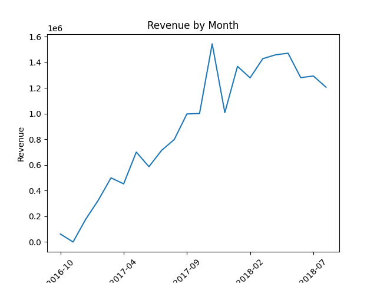
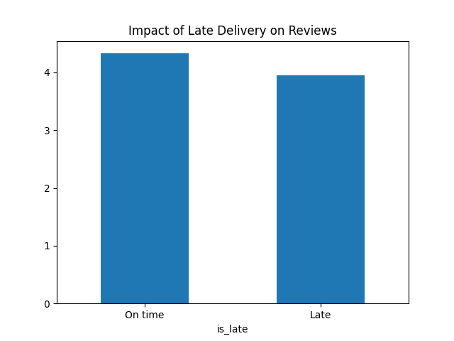
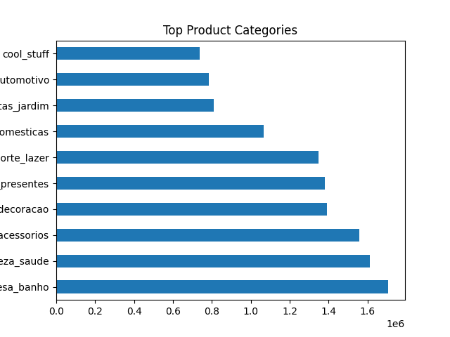

# E-commerce Data Analysis Project (Olist)

## 📊 Dashboard Preview

##  Objective
This project analyzes an e-commerce dataset to extract insights on sales performance, customer behavior, and delivery efficiency.

The goal is to transform raw transactional data into actionable business insights using Python and data analysis techniques.

---

##  Dataset
The dataset comes from an e-commerce platform and includes multiple relational tables:

- Orders
- Customers
- Products
- Payments
- Order items
- Reviews

---

##  Methodology

### 1. Data Loading
Multiple CSV files were loaded and inspected using Pandas.

### 2. Data Cleaning
- Handled missing values
- Converted date columns
- Standardized formats

### 3. Data Integration
All tables were merged into a single analytical dataset using key identifiers (order_id, customer_id, product_id).

### 4. Feature Engineering
New variables were created:
- Month of purchase
- Delivery time
- Late delivery flag

---

##  Analysis Performed

- Revenue evolution over time
- Customer satisfaction analysis 
- Delivery performance (late deliveries)
- Top-performing product categories 

---

##  Key KPIs

- Total Revenue
- Number of Orders
- Average Basket Value
- Late Delivery Rate

---

##  Key Insights

- Revenue shows clear monthly seasonality patterns
- Late deliveries significantly reduce customer satisfaction scores
- A small number of product categories generate most of the revenue (Pareto effect)
- Delivery performance is a key driver of customer reviews
---

##  Tools Used
- Python (Pandas, Matplotlib)
- Jupyter Notebook
- Data visualization libraries

## 📌 Project Structure
/notebook.ipynb/data (optional)
/images
README.md

## Outcome
This project demonstrates end-to-end data analysis skills including data cleaning, transformation, analysis, and storytelling.
